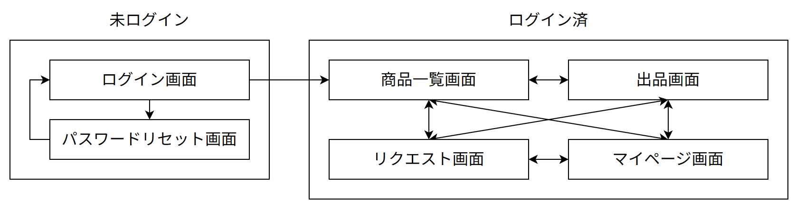
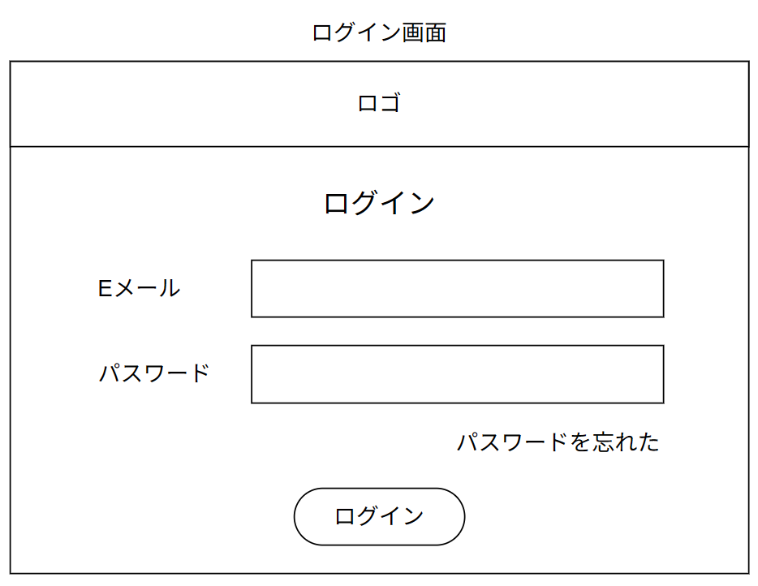
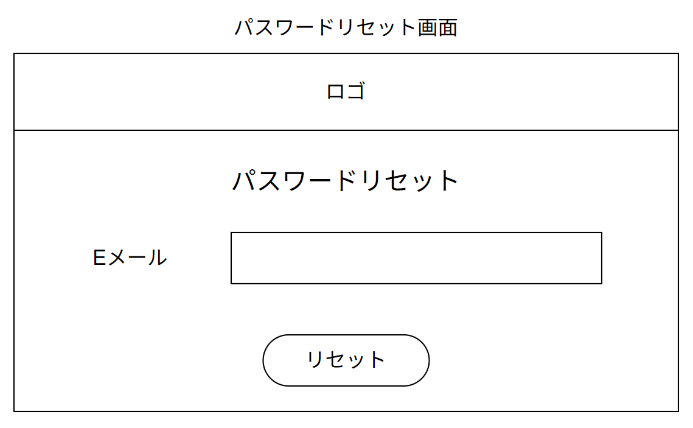
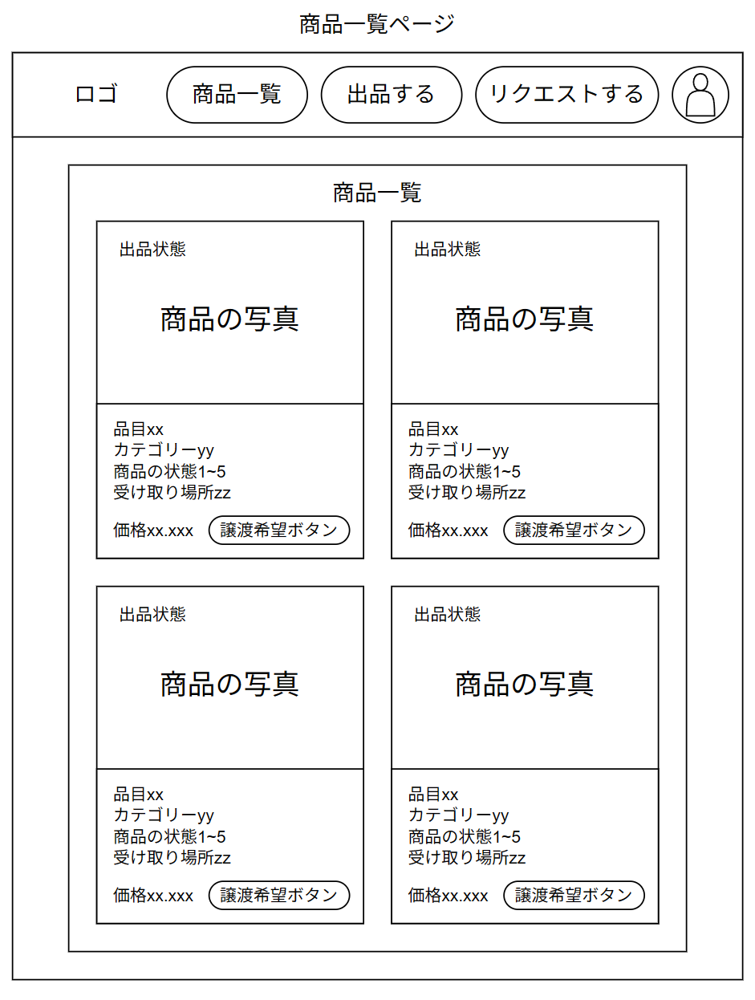
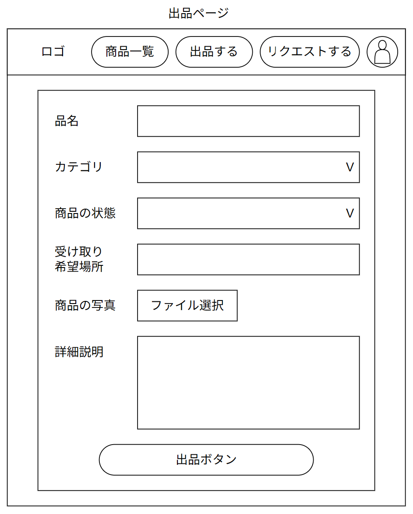
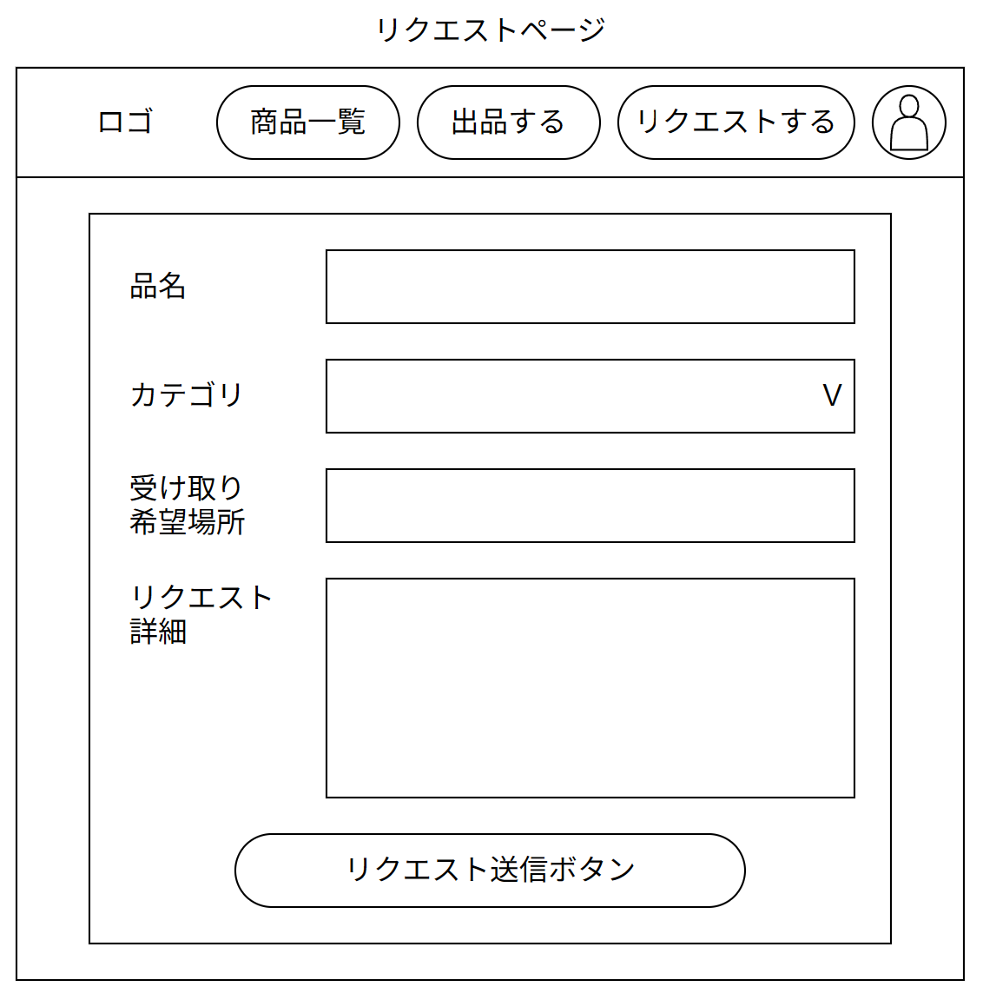
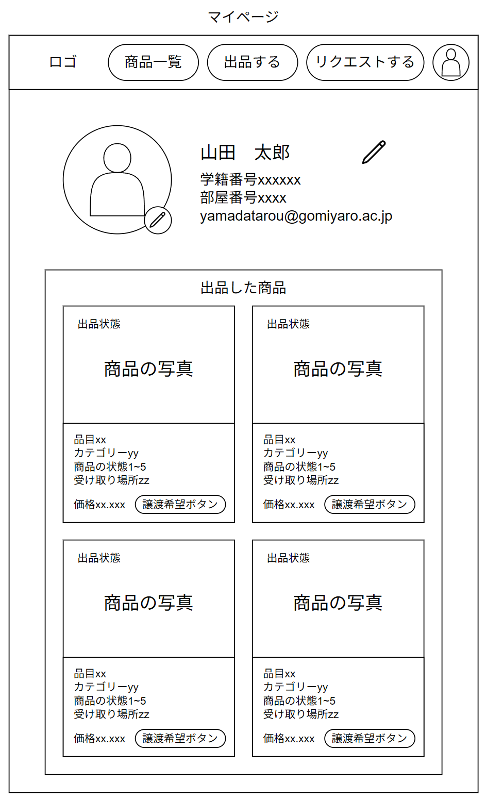

# 基本設計（外部設計）項目一覧

**プロジェクト名：校内資源マッチングシステム（仮）**

## 1. システム構成・インフラ設計
システム全体のハードウェア、ソフトウェア、ネットワークの配置図。

* **システム構成図 (Architecture Diagram)**
    * クライアント（学生のスマホ/PCブラウザ）
    * Webサーバー / アプリケーションサーバーの配置
    * データベースサーバーの配置
* **利用技術スタック (Technology Stack)**
    * フロントエンド（例: HTML/CSS/JavaScript, Next.js など）
    * バックエンド（例: Node.js, Python, PHP など）
    * データベース（例: PostgreSQL, MySQL, Supabase など）
    * インフラ・ホスティング（例: Vercel, Render, AWS など）

---

## 2. 画面設計 (UI/UX Design)
* **画面遷移図 (Screen Transition Diagram)**
    * 全画面の繋がり（トップ ↔ 詳細 ↔ 購入確認 ↔ 完了）を可視化した図
    
* **画面一覧 (Screen List)**
    * システムに存在する全画面のIDと名称の一覧
        * user_login: ログイン画面
        * user_forgotpass: パスワードリセット画面
        * products_list: 商品一覧画面
        * products_sell: 出品画面
        * products_request: リクエスト画面
        * user_mypage: マイページ画面
* **ワイヤーフレーム / 画面レイアウト (Wireframes)**
    * ログイン画面\
     

    * パスワードリセット画面\
    

    * 商品一覧画面\
    

    * 出品画面\
    

    * リクエスト画面\
    

    * マイページ画面\
    
* **画面コンポーネント・共通デザインルール**
    <!-- * カラーパレット、フォント、ボタンの共通スタイル、レスポンシブ（スマホ対応）基準 -->
    * カラーパレット（通常 -> ホバー時）
        * プライマリカラー（#007bff -> #0056b3）
        * セカンダリカラー（#28a745 -> #218838）
        * 取引関連要素カラー（#ffc107 -> #dca70b）
        * 検索関連要素カラー（#17a2b8 -> #138496）
        * セクション背景カラー（#ced4da）
        * ボーダーカラー（#e9ecef）
        * 白（#f4f6f9）
        * 真白（#fff）
        * ダークグレイ（#333）
        * ライトグレイ（#999）
        * グレイ（#666）
        * 赤（#c44）\
        なお，価格の無料表示カラーは赤，有料表示カラーはセカンダリカラーを用いる．
    * フォント
        * 全体のフォントには，以下のフォントを使用する。
            * Helvetica Neue
            * Arial
            * sans-serif
    * ボタン

        |項目|設定|
        |----|----|
        |表示形式|inline-block|
        |パディング|上下 10px，左右 20px|
        |丸み|6px|
        |文字|太字，中央揃え|

    * レスポンシブ基準
        * 920px以下：ヘッダを縦方向に配置
        * 770px以下：フォームを縦方向に配置
        * 530px以下：ナビゲーションを縦方向に配置

---

## 3. 機能設計 (Functional Design)
要件定義の機能を、システムが処理する単位に落とし込んだ仕様。

* **機能一覧 (Function List)**
    * 画面機能、バッチ機能、管理者機能の一覧
* **機能詳細仕様 (Function Specifications)**
    * 各機能の入力、処理内容、出力（表示内容）の定義
    * *例：【商品登録機能】*
        * **入力チェック**：必須項目、画像ファイル形式、文字数制限
        * **登録処理**：DBへのインサート、画像サーバーへのアップロード
        * **処理後の動作**：登録完了メッセージ表示、詳細画面への遷移

---

## 4. データモデル・データベース設計 (Database Design)
システムで扱うデータの構造と保持方法。

* **ER図 (Entity Relationship Diagram)**
    * テーブル同士の繋がり（1対多、多対多など）を表した概念・物理図
* **テーブル定義書 (Table Definitions)**
    * 各テーブルの構造（カラム名、データ型、制約、主キー、論理名/物理名）
    * **作成予定の主要テーブル：**
        * `users`（ユーザー情報：学籍番号、ニックネーム等）
        * `products`（商品情報：商品ID、品名、状態、カテゴリ、画像URL、ステータス等）
        * `transactions`（取引情報：取引ID、商品ID、出品者ID、購入者ID、取引日時等）

---

## 5. 外部インターフェース設計 (Interface Design)
外部のシステムやサービス、またはフロントエンドとバックエンド間の通信仕様。

* **外部サービス連携仕様（該当する場合）**
    * LINE / Discord への通知API連携、画像ホスティング（Cloudinary等）との連携仕様
* **API定義書 / Webhook仕様（必要に応じて）**
    * フロントエンドとバックエンド間でやり取りするリクエスト/レスポンスのデータ形式（JSON等）

---

## 6. 運用・セキュリティ・非機能設計 (Non-Functional Design)
システムの品質や運用ルールを担保するための設計。

* **セキュリティ設計**
    * 認証・認可の仕組み（ログイン方法、管理者権限の区別）
    * 脆弱性対策（SQLインジェクション、XSS、CSRF対策）
* **バックアップ・トラブルシューティング方針**
    * データベースのバックアップ頻度と保存先
    * エラー発生時のログ出力ルール
* **移行・初期データ投入計画**
    * カテゴリマスター（「自転車」「教科書」など）の初期データ投入手順
